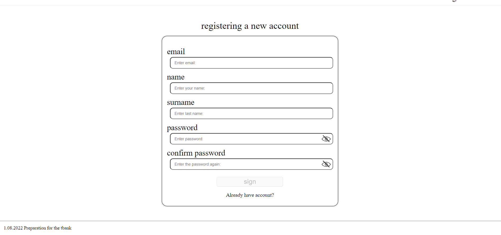

# Tbank


Educational project for learning different functions of Angular.

These bank functions have been implemented in Angular. It contains the following functions: registration, login, creating a new card, creating a savings account / closing a savings account, sending funds to another bank client, sending funds from a card to a savings account, history of actions

## Login

### Register your

You can register your page:



### Use password and login

Or use your username and password

- "mail": ```imbettermagician@hog.ru```
- "password": ```123456```

## Send funds to other clients' accounts

Here are some card accounts you can send to:

- Hermione Granger card: ```3743 9124 2025 3967```
- Ron Weasley card: ```3674 4125 2091 7294```

## Project setup

```
npm install
npm run serve
json-server --watch db.json
```

